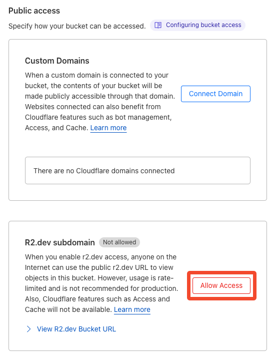

# cancellation-manual-backend

## 目次

<!-- START doctoc generated TOC please keep comment here to allow auto update -->
<!-- DON'T EDIT THIS SECTION, INSTEAD RE-RUN doctoc TO UPDATE -->

- [環境構築](#%E7%92%B0%E5%A2%83%E6%A7%8B%E7%AF%89)
- [Cloudflare R2 バケットの作成](#cloudflare-r2-%E3%83%90%E3%82%B1%E3%83%83%E3%83%88%E3%81%AE%E4%BD%9C%E6%88%90)
- [サブドメインの有効化](#%E3%82%B5%E3%83%96%E3%83%89%E3%83%A1%E3%82%A4%E3%83%B3%E3%81%AE%E6%9C%89%E5%8A%B9%E5%8C%96)
- [デプロイ](#%E3%83%87%E3%83%97%E3%83%AD%E3%82%A4)

<!-- END doctoc generated TOC please keep comment here to allow auto update -->

## 環境構築

```shell
$ bun i
```

## Cloudflare R2 バケットの作成

```shell
$ bunx wrangler r2 bucket create cancellation-manual-images
```

## サブドメインの有効化

`R2`-> `cancellation-manual-images` -> `Settings`


## デプロイ

```shell
$ bun run deploy
```
